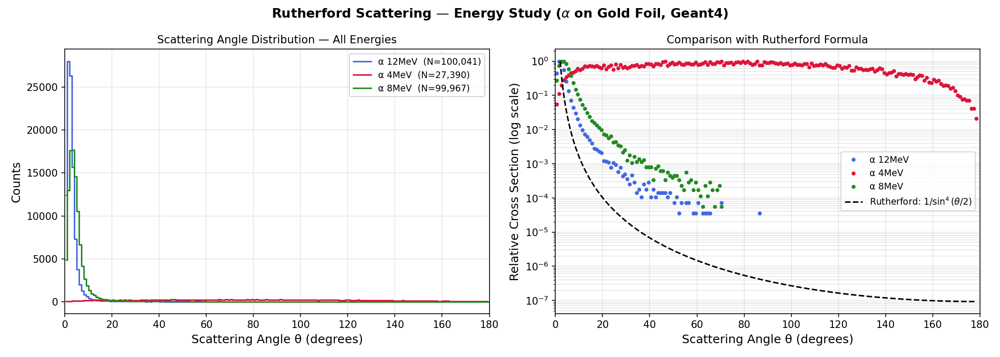

# Rutherford Scattering — Energy Study

> A **Geant4 Monte Carlo simulation** studying how alpha particle energy affects Rutherford scattering.  
> Three energies simulated: **4 MeV · 8 MeV · 12 MeV** | Gold foil (5 μm) | 100,000 events each  
> Based on Geant4 B1 example | Geant4 v11.3

---

## Result



**Key physics:** Higher energy alphas scatter less — they spend less time near the nucleus so the Coulomb deflection is smaller. The peak of the distribution shifts toward smaller angles as energy increases.

---

## Physics

The Rutherford scattering angle depends on energy as:

```
cot(θ/2) = (2E · b) / (Z₁Z₂e²)
```

where `b` is the impact parameter and `E` is the kinetic energy. Higher energy → smaller deflection for the same `b`. This means the scattering distribution narrows and peaks closer to 0° as energy increases.

---

## Geometry

```
  [Alpha gun, variable energy, +Z]
          │
          ▼
    ┌───────────┐   Gold foil (Au), 5 μm,  z = 2 mm
    └───────────┘
          │
          ▼
    ┌───────────┐   Silicon Detector (scoring), z = 10 mm
    └───────────┘
          │
          ▼
   rutherford_4MeV.root
   rutherford_8MeV.root
   rutherford_12MeV.root
```

---

## Project Structure

```
Rutherford_Estudy/
├── CMakeLists.txt
├── exampleB1.cc              ← main (batch mode, no GUI)
├── run_Estudy.mac            ← runs 4, 8, 12 MeV in sequence
├── run1.mac / run2.mac       ← original test macros
├── vis.mac                   ← visualization (interactive only)
├── plot_Estudy.py            ← plots all 3 energies + Rutherford formula
├── include/  ...
├── src/
│   ├── RunAction.cc          ← saves separate .root per energy
│   └── ...
└── results/
    └── rutherford_Estudy.png
```

---

## Prerequisites

| Requirement | Version |
|---|---|
| Geant4 | ≥ 11.0 |
| CMake | ≥ 3.16 |
| Python + uproot + numpy + matplotlib | latest |

---

## Build & Run

```bash
# 1. Source Geant4
source /path/to/geant4/install/bin/geant4.sh

# 2. Build
cd Rutherford_Estudy
mkdir build && cd build
cmake ..
make -j4

# 3. Run all 3 energies in one go (no GUI)
./exampleB1 ../run_Estudy.mac

# 4. Plot
pip3 install uproot awkward numpy matplotlib
python3 ../plot_Estudy.py

# 5. Copy plot to results folder
mkdir -p ../results
cp results/rutherford_Estudy.png ../results/
```

---

## Adding More Energies

Edit `run_Estudy.mac`:
```
/gun/energy 16 MeV
/run/beamOn 100000
```

The Python script automatically detects all `rutherford_*MeV.root` files and plots them all.

---

## References

- Rutherford, E. (1911). *Phil. Mag.* 21, 669.
- [Geant4 Collaboration, NIM A 506 (2003) 250–303](https://doi.org/10.1016/S0168-9002(03)01368-8)
