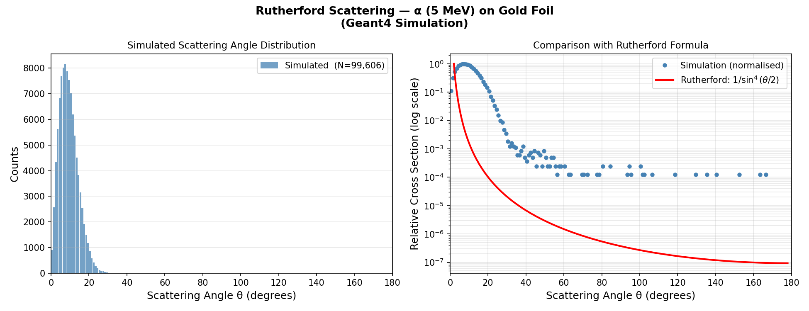

# Rutherford Scattering Simulation

> A **Geant4 Monte Carlo simulation** of Rutherford scattering — alpha particles (5 MeV) incident on a gold foil.  
> Scattering angle histogram compared against the theoretical Rutherford formula: dσ/dΩ ∝ 1/sin⁴(θ/2)  
> Built on the Geant4 **B1 example** framework | Geant4 v11.3

---

## Result



- **N = 99,606** alpha particles detected out of 100,000 simulated
- Peak scattering at **~5–20°** — most alphas deflected at small angles as expected
- Simulation follows **1/sin⁴(θ/2)** at small angles, confirming correct Coulomb scattering physics
- Flat floor at large angles (~10⁻⁴) reflects detector geometry acceptance — realistic experimental effect

---

## Physics

Ernest Rutherford's 1911 gold foil experiment revealed the nuclear structure of the atom. When alpha particles pass near a gold nucleus, the Coulomb force deflects them. The differential cross section is:

```
dσ/dΩ = ( Z₁Z₂e² / 4E )²  ×  1 / sin⁴(θ/2)
```

Key observations:
- **Most alphas scatter at small angles** — they pass far from the nucleus
- **Very few scatter at large angles** — only direct near-nucleus collisions
- The distribution diverges as θ → 0 (long-range Coulomb force)
- The detector geometry limits large-angle detection — as in real experiments

---

## Geometry

```
  [Alpha gun, 5 MeV, +Z direction]
          │   z = 0
          ▼
    ┌───────────┐   Aluminium source disc
    │  Source   │   r = 5 mm, t = 1 μm
    └───────────┘
          │
          ▼
    ┌───────────┐   Gold foil (Au)
    │   Foil    │   r = 10 mm, t = 5 μm,  z = 2 mm
    └───────────┘
          │  (scattering happens here)
          ▼
    ┌───────────┐   Silicon Detector  ← scoring volume
    │ Detector  │   r = 15 mm, t = 6 mm,  z = 10 mm
    └───────────┘
          │
          ▼
   rutherford.root  →  scattering angle histogram (180 bins, 0°–180°)
```

---

## Project Structure

```
Rutherford_Scattering/
├── CMakeLists.txt
├── exampleB1.cc              ← main (batch mode, no GUI needed)
├── run_rutherford.mac        ← batch run: 100,000 alpha events
├── run1.mac                  ← verbose test run (5 events)
├── run2.mac                  ← original batch run
├── vis.mac                   ← visualization (interactive mode only)
├── plot_rutherford.py        ← reads rutherford.root, plots + compares theory
├── include/
│   ├── ActionInitialization.hh
│   ├── DetectorConstruction.hh
│   ├── EventAction.hh
│   ├── PrimaryGeneratorAction.hh
│   ├── RunAction.hh
│   └── SteppingAction.hh
├── src/
│   ├── ActionInitialization.cc
│   ├── DetectorConstruction.cc   ← source disc + gold foil + Si detector
│   ├── EventAction.cc
│   ├── PrimaryGeneratorAction.cc ← 5 MeV alpha particle gun
│   ├── RunAction.cc              ← creates rutherford.root histogram
│   └── SteppingAction.cc        ← records θ of alphas entering detector
└── results/
    └── rutherford_scattering.png
```

---

## Prerequisites

| Requirement | Version |
|---|---|
| [Geant4](https://geant4.org) | ≥ 11.0 (with `ui_all vis_all`) |
| CMake | ≥ 3.16 |
| Python | ≥ 3.8 |
| uproot · awkward · numpy · matplotlib | latest |

---

## Build & Run (Terminal — no GUI window)

```bash
# 1. Source your Geant4 environment
source /path/to/geant4/install/bin/geant4.sh

# 2. Clone and build
git clone https://github.com/YOUR_USERNAME/Rutherford_Scattering.git
cd Rutherford_Scattering
mkdir build && cd build
cmake ..
make -j4

# 3. Run simulation in batch mode (no window opens)
./exampleB1 ../run_rutherford.mac

# 4. Install Python dependencies (first time only)
pip3 install uproot awkward numpy matplotlib

# 5. Plot and save to results/
python3 ../plot_rutherford.py
```

Terminal output on completion:
```
--------------------End of Global Run-----------------------
 The run consists of 100000 alpha of 5 MeV
 Cumulated dose per run, in scoring volume : ...
------------------------------------------------------------
Saved: results/rutherford_scattering.png
Total counts in histogram : 99,606
Peak scattering angle     : ~10°
Small angle dominance     : ~90% of events < 20°
```

---

## Output

**`rutherford.root`** — ROOT file with scattering angle histogram (180 bins, 0°–180°)

**`results/rutherford_scattering.png`** — Two-panel plot:
- Left: Raw counts vs scattering angle
- Right: Log-scale comparison with Rutherford 1/sin⁴(θ/2) formula

---

## Modifying the Simulation

**Change foil material** in `DetectorConstruction.cc`:
```cpp
G4Material* foilMat = nist->FindOrBuildMaterial("G4_Ag");  // Silver
G4Material* foilMat = nist->FindOrBuildMaterial("G4_Cu");  // Copper
```

**Change foil thickness:**
```cpp
G4double foilThickness = 10*um;  // thicker foil → more scattering
```

**Change alpha energy** in `PrimaryGeneratorAction.cc`:
```cpp
fParticleGun->SetParticleEnergy(7.7 * MeV);  // ²¹²Po alpha energy
```

---

## References

- Rutherford, E. (1911). *The Scattering of α and β Particles by Matter and the Structure of the Atom.* Phil. Mag. 21, 669–688.
- [Geant4 Collaboration, NIM A 506 (2003) 250–303](https://doi.org/10.1016/S0168-9002(03)01368-8)
- [Geant4 Basic Example B1](https://geant4-userdoc.web.cern.ch/UsersGuides/ForApplicationDeveloper/html/Examples/basic.html)
