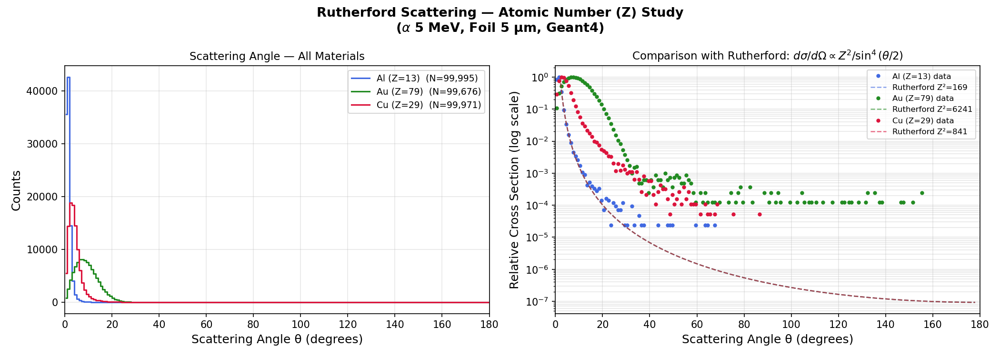

# Rutherford Scattering — Atomic Number (Z) Study

> A **Geant4 Monte Carlo simulation** studying how the atomic number Z of the foil material affects Rutherford scattering.  
> Three materials: **Al (Z=13) · Cu (Z=29) · Au (Z=79)** | Alpha 5 MeV | Foil 5 μm | 100,000 events each  
> Based on Geant4 B1 example | Geant4 v11.3

---

## Result



**Key physics:** Higher Z → stronger Coulomb force → more large-angle scattering.  
The cross section scales as **Z²**, so gold (Z=79) scatters at much larger angles than aluminium (Z=13).

---

## Physics

The Rutherford differential cross section depends on Z²:

```
dσ/dΩ = ( Z₁Z₂e² / 4E )²  ×  1/sin⁴(θ/2)
```

Since Z₁ (alpha) is fixed at 2, doubling Z₂ quadruples the cross section at every angle.  
Comparing Al (Z=13), Cu (Z=29), Au (Z=79):

| Material | Z | Z² | Relative σ |
|---|---|---|---|
| Aluminium | 13 | 169 | 1× |
| Copper | 29 | 841 | 5× |
| Gold | 79 | 6241 | 37× |

---

## Geometry

```
  [Alpha gun, 5 MeV, +Z]
          │
          ▼
    ┌───────────┐   Foil, 5 μm,  z = 2 mm
    │  Al/Cu/Au │   material changed per run
    └───────────┘
          │
          ▼
    ┌───────────┐   Silicon Detector (scoring),  z = 10 mm
    └───────────┘
          │
          ▼
   rutherford_Al_Z13.root
   rutherford_Cu_Z29.root
   rutherford_Au_Z79.root
```

---

## How to Run 3 Materials

Since the foil material is set in `DetectorConstruction.cc`, change it and rebuild for each run:

### Step 1 — Aluminium (Z=13) — already set in your file
```bash
make -j4
./exampleB1 ../run_Al.mac
```

### Step 2 — Copper (Z=29)
In `DetectorConstruction.cc`, change:
```cpp
G4Material* foilMat = nist->FindOrBuildMaterial("G4_Cu");
```
Then:
```bash
make -j4
./exampleB1 ../run_Cu.mac
```

### Step 3 — Gold (Z=79)
```cpp
G4Material* foilMat = nist->FindOrBuildMaterial("G4_Au");
```
Then:
```bash
make -j4
./exampleB1 ../run_Au.mac
```

### Step 4 — Plot all together
```bash
pip3 install uproot awkward numpy matplotlib
python3 ../plot_Zstudy.py
mkdir -p ../results
cp results/rutherford_Zstudy.png ../results/
```

---

## Project Structure

```
Rutherford_Zstudy/
├── CMakeLists.txt
├── exampleB1.cc
├── run_Al.mac            ← Al foil → rutherford_Al_Z13.root
├── run_Cu.mac            ← Cu foil → rutherford_Cu_Z29.root
├── run_Au.mac            ← Au foil → rutherford_Au_Z79.root
├── run1.mac / run2.mac
├── vis.mac / init_vis.mac
├── plot_Zstudy.py        ← overlays all 3 materials + Z² theory
├── include/ ...
├── src/
│   ├── DetectorConstruction.cc  ← change foilMat here per run
│   └── RunAction.cc             ← uses /analysis/setFileName from mac
└── results/
    └── rutherford_Zstudy.png
```

---

## Other Materials to Try

Any NIST material works — change in `DetectorConstruction.cc`:

```cpp
G4Material* foilMat = nist->FindOrBuildMaterial("G4_Ag");  // Silver Z=47
G4Material* foilMat = nist->FindOrBuildMaterial("G4_Fe");  // Iron Z=26
G4Material* foilMat = nist->FindOrBuildMaterial("G4_Pb");  // Lead Z=82
```

---

## References

- Rutherford, E. (1911). *Phil. Mag.* 21, 669.
- [Geant4 NIST Materials Database](https://geant4-userdoc.web.cern.ch/UsersGuides/ForApplicationDeveloper/html/Appendix/materialNames.html)
- [Geant4 Collaboration, NIM A 506 (2003) 250–303](https://doi.org/10.1016/S0168-9002(03)01368-8)
