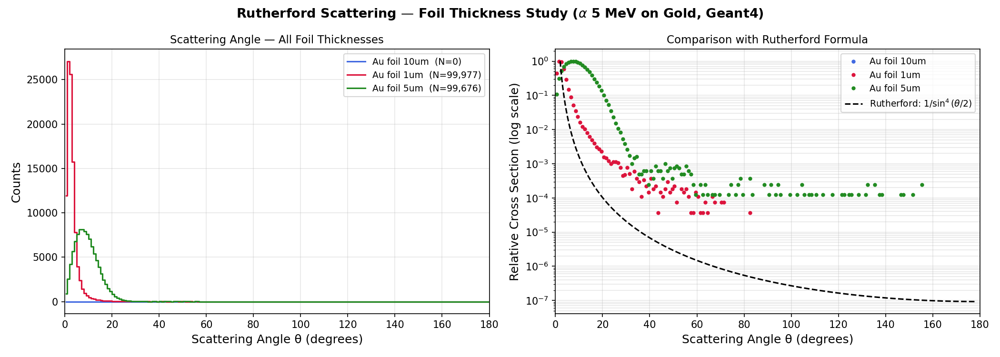

# Rutherford Scattering — Foil Thickness Study

> A **Geant4 Monte Carlo simulation** studying how gold foil thickness affects Rutherford scattering.  
> Three thicknesses: **1 μm · 5 μm · 10 μm** | Alpha particles 5 MeV | 100,000 events each  
> Based on Geant4 B1 example | Geant4 v11.3

---

## Result



**Key physics:** Thicker foils cause more scattering — more gold nuclei per unit area means more Coulomb collisions. The scattering distribution broadens and more particles appear at large angles as thickness increases. Very thick foils also cause more energy loss (stopping), reducing count rates.

---

## Physics

The scattering probability scales with foil thickness `t` (number of atoms per unit area):

```
N_scattered / N_incident  ∝  n · t · dσ/dΩ
```

where `n` is the number density of gold atoms. Doubling the thickness doubles the number of scattering centres, so the large-angle tail grows proportionally.

---

## Geometry

```
  [Alpha gun, 5 MeV, +Z]
          │
          ▼
    ┌───────────┐   Gold foil (Au), variable thickness,  z = 2 mm
    └───────────┘   1 μm / 5 μm / 10 μm
          │
          ▼
    ┌───────────┐   Silicon Detector (scoring),  z = 10 mm
    └───────────┘
          │
          ▼
   rutherford_1um.root
   rutherford_5um.root
   rutherford_10um.root
```

---

## How to Run 3 Thicknesses

Since foil thickness is set in `DetectorConstruction.cc`, run each thickness by editing the file and rebuilding:

### Step 1 — 1 μm foil
In `DetectorConstruction.cc`, set:
```cpp
G4double foilThickness = 1*um;
```
Then:
```bash
make -j4
./exampleB1 ../run_1um.mac
```

### Step 2 — 5 μm foil
Change to:
```cpp
G4double foilThickness = 5*um;
```
Then:
```bash
make -j4
./exampleB1 ../run_5um.mac
```

### Step 3 — 10 μm foil
Change to:
```cpp
G4double foilThickness = 10*um;
```
Then:
```bash
make -j4
./exampleB1 ../run_10um.mac
```

### Step 4 — Plot all together
```bash
pip3 install uproot awkward numpy matplotlib
python3 ../plot_thickness.py
mkdir -p ../results
cp results/rutherford_thickness.png ../results/
```

---

## Project Structure

```
Rutherford_thickness/
├── CMakeLists.txt
├── exampleB1.cc
├── run_1um.mac           ← batch run, saves rutherford_1um.root
├── run_5um.mac           ← batch run, saves rutherford_5um.root
├── run_10um.mac          ← batch run, saves rutherford_10um.root
├── run1.mac / run2.mac   ← original test macros
├── vis.mac / init_vis.mac
├── plot_thickness.py     ← overlays all 3 thickness results
├── include/ ...
├── src/
│   ├── DetectorConstruction.cc  ← change foilThickness here per run
│   └── RunAction.cc             ← uses /analysis/setFileName from mac
└── results/
    └── rutherford_thickness.png
```

---

## Prerequisites

| Requirement | Version |
|---|---|
| Geant4 | ≥ 11.0 |
| CMake | ≥ 3.16 |
| Python + uproot + numpy + matplotlib | latest |

---

## References

- Rutherford, E. (1911). *Phil. Mag.* 21, 669.
- [Geant4 Collaboration, NIM A 506 (2003) 250–303](https://doi.org/10.1016/S0168-9002(03)01368-8)
